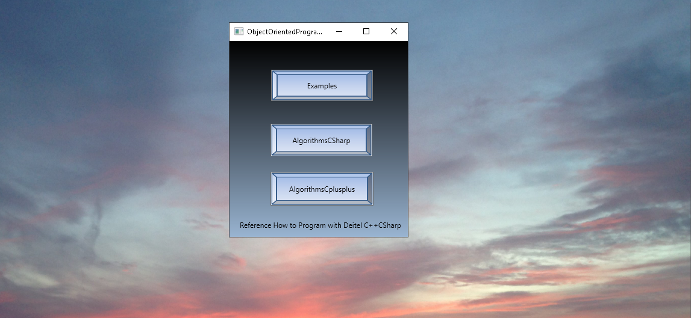

# ObjectOrientedDesignProgramming

The project provides a few examples of object oriented design programming.Confidential information is not displayed. 
Please download the executable in https://github.com/alpaddesai/ObjectOrientedDesignProgramming/releases for details. 
All images are custom by Alpa D Desai. Copyright protection in process.

## Algorithms 

## Algorithms in C++

## Practice designs in CSharp

