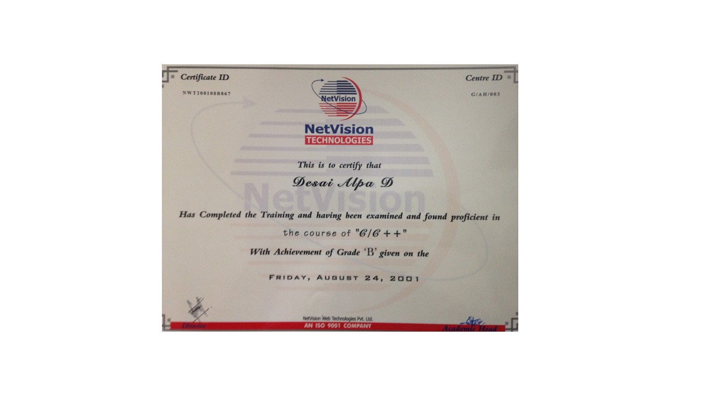

# Object Oriented Design Programming

The project provides a few examples of object oriented design programming.Confidential information is not displayed. 
Please download the executable in https://github.com/alpaddesai/ObjectOrientedDesignProgramming/releases for details. 
All images are custom by Alpa D Desai.

## OOD Functionality

## Algorithms 

## Algorithms in C++ (eclipse IDE)

## Practice designs in C#

## Practice designs in C++
### Modern C++: (lambda, delegate,smart pointers, smart pointers)

## C programming

## C# Certification

## C++ Certification

## Object Oriented Programming in Linux, g++

## C_C++ Certification

## Algorithms 

## Exam

## Ethics and Integrity

 Additional details for HDL reference: https://github.com/alpaddesai/DataStructures
